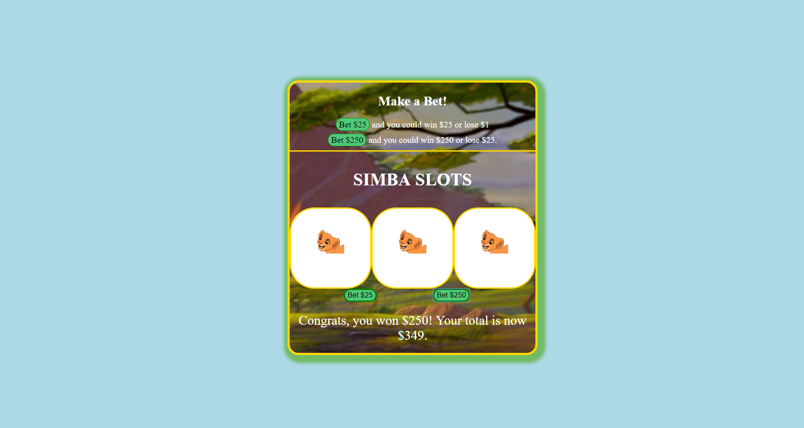

# 🎰 Slot Machine

This slot machine randomizes an array 3 times and displays in the DOM to show the user whether they won or lost money.

### How It's Made:

**Tech used:** HTML5, CSS3, Javascript

Did layout, gave IDs for all necessary elements to be used in JS. On the click of each button, a specific function, encompassing 2 more functions, runs for that button. Those three functions run to: 'spin the slots' by randomly selecting an array index and then displaying the random selection into the DOM and 'compare the slot rolls' by checking through an if/else statement where if all slots match winner wins the max amount of money for the button they clicked, else they lose the minimum amount of money for the button they clicked.

## Lessons Learned:

I really enjoyed this project. Found out that it is never bad to include another function. Having a function inside of a function inside of another function happens. I feel like my code in this project is clean.
